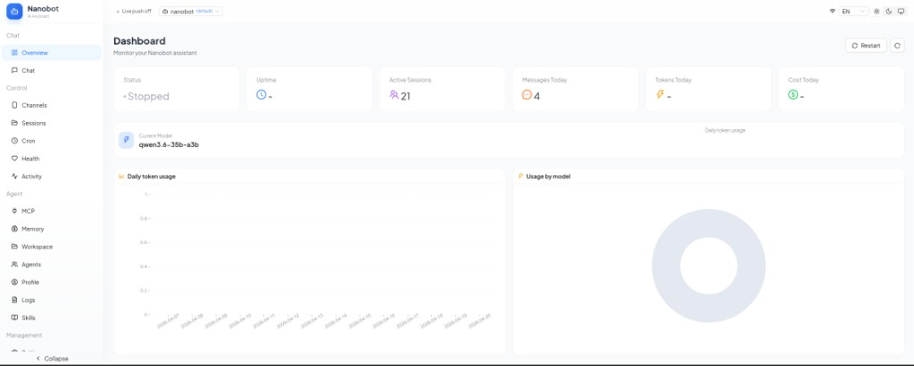
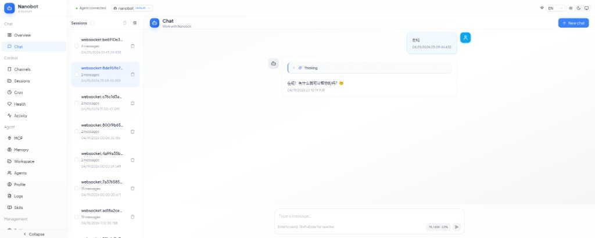
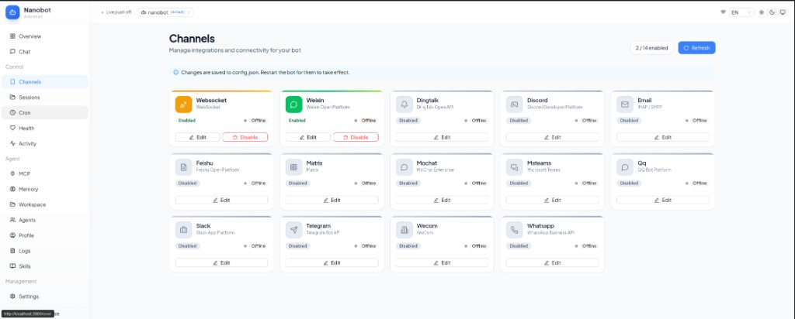

# OpenPawlet

**Languages:** [中文说明](README.zh.md)

## What it is

OpenPawlet (PyPI package name `open-pawlet`) is a **web console** for the **[nanobot](https://github.com/JackLuguibin/nanobot)** ecosystem. It exposes an HTTP API and a browser UI that works alongside the `nanobot gateway` over WebSocket so you can manage bot-related resources locally or in deployment.

**Stack:** FastAPI backend (consistent error envelope and OpenAPI; docs can be disabled in production via settings) and a Vite frontend under `src/console/web` (HMR in development, production build supported).

## Feature areas

The console roughly covers the areas below (see the UI and OpenAPI for the exact surface):

| Area | Capabilities |
|------|--------------|
| **Bots & agents** | Inspect and manage bots and agents |
| **Chat & channels** | Sessions, chat, channels; debug with gateway WebSocket and realtime events |
| **Config & env** | Console and bot configuration, environment variables, bot file access (e.g. `bot_files`) |
| **Tools & extensions** | Tools, MCP servers, skills, memory |
| **Automation** | Cron jobs |
| **Ops & observability** | Status, health, health audit, usage, alerts, activity; control endpoints where applicable |
| **Workspace** | Workspace browsing and management |
| **Session transcripts** (nanobot) | Optional append-only JSONL logs under workspace `transcripts/` when `agents.defaults.persistSessionTranscript` is true; `transcriptIncludeFullToolResults` controls full tool payloads in the log |

**Typical use:** run next to `nanobot gateway` to inspect status, debug sessions, and manage these resources from the console.

## Screenshots

The **Nanobot** web UI (branded “Nanobot · AI Assistant” in the console) provides a sidebar for Chat, Control, Agent, and Management areas, plus a top bar for workspace selection, language, theme, and gateway status.

### Dashboard overview

The overview page surfaces key metrics (status, uptime, active sessions, messages, tokens, cost), the **current model**, and charts such as daily token usage and usage by model—useful for at-a-glance monitoring in local or deployed setups.



### Chat

The chat view supports **multiple sessions** (list with message counts and last activity), streaming-style replies with optional **thinking** / progress indicators, and an input area with token budget hints. Navigation to channels, MCP, memory, workspace, agents, skills, and related tools stays one click away in the sidebar.



### Channels

**Channels** lists integrations for your bot (for example WebSocket, Weixin, DingTalk, Discord, Email, Feishu, Matrix, MoChat, Microsoft Teams, QQ, Slack, Telegram, WeCom, and WhatsApp). You can enable or edit each channel from the grid; the UI notes that changes are saved to `config.json` and that you should **restart the bot** for them to take effect.



## Architecture notes

- **Backend:** FastAPI-based OpenPawlet service with a consistent error envelope and OpenAPI documentation.
- **Frontend:** Vite app under `src/console/web`, with HMR in development and a production build path.

## Tech stack

| Layer | Technology |
|-------|------------|
| Runtime | Python ≥ 3.11 |
| Backend | FastAPI, Uvicorn, Pydantic v2, Loguru |
| nanobot integration | Bundled in this repo (`src/nanobot`); installed as part of `open-pawlet` |
| Frontend | Node.js + npm (see `src/console/web`) |
| Multi-process (optional) | Honcho + `Procfile` |

## Quick start

### 1. Virtual environment and install

A project-local `.venv` is recommended:

```bash
python3.11 -m venv .venv
source .venv/bin/activate   # Windows: .venv\Scripts\activate
pip install --upgrade pip
pip uninstall -y nanobot-ai  # if you still had the old PyPI package; otherwise skip
pip install -e ".[dev]"
```

The `nanobot` Python package ships inside this repository; `pip install -e ".[dev]"` installs the console and nanobot together.

### 2. Frontend dependencies

```bash
cd src/console/web && npm install && cd ../../..
```

### 3. Run

**API only** (defaults to `0.0.0.0:8000`; tune with `NANOBOT_SERVER_*` env vars, see `ServerSettings`):

```bash
console server
```

**Frontend dev**:

```bash
console web dev
```

**All-in-one** (requires `honcho` and a working `nanobot` CLI for the gateway):

```bash
honcho start
```

The default `Procfile` runs: `nanobot gateway`, `console server`, and `console web dev`.

**Single-command production** (API + SPA on one port, nanobot gateway spawned automatically):

```bash
npm --prefix src/console/web run build
open-pawlet start   # binds 0.0.0.0:8000 by default; open http://localhost:8000
```

`open-pawlet start` runs the FastAPI server, mounts the prebuilt SPA from
`src/console/web/dist` (so the UI and `/api/v1/*` share a single origin and
port), **and spawns `nanobot gateway` as a child process** so the console can
immediately talk to nanobot over WebSocket. On first launch it also runs
`nanobot onboard` if `~/.nanobot/config.json` is missing. Pressing Ctrl+C
stops both processes together.

Pass `--no-gateway` when the gateway is managed externally (honcho, systemd,
docker-compose, …) and you only want the API + SPA in this command. Run
`npm run build` (or `console web build`) whenever the frontend changes.

## Version history (timeline)


Major releases for the `open-pawlet` PyPI package (matches `[project] version` in the root `pyproject.toml`). The console is built for the **nanobot** stack; embedded **nanobot** lives under `src/nanobot` and ships with each install. **Newest at the top; older entries below.** Add new rows at the **top** when you cut a release.

```text
2026-04-20 ──●── 0.2.2  nanobot WebSocket (session lifecycle, delta stream, busy state); tests/docs; UI & dashboard
              │
2026-04-19 ──●── 0.2.1  Aligned versions (pyproject, API schema, web); nanobot + console version metadata
              │
2026-04-19 ──●── 0.2.0  Deps & packaging; README; bundled nanobot; WhatsApp bridge under bridge/
              │
2026-04-19 ──●── 0.1.0  First release: FastAPI console for nanobot, CLI, workspace, README / Procfile
```

| Date | Version | Summary |
|------|---------|---------|
| 2026-04-20 | **0.2.2** | **nanobot:** WebSocket session lifecycle, delta streaming, and busy-state handling in gateway and UI; broader nanobot test coverage and channel docs. Console: dashboard/charts, activity filters, workspace and bot-profile flows, ErrorBoundary, layout and control tweaks; CI and Vitest hardening. |
| 2026-04-19 | **0.2.1** | Single source of truth for version strings (Python package, server API version, frontend `package.json`) so **nanobot**-embedded installs report consistent versions end-to-end. |
| 2026-04-19 | **0.2.0** | Dependency and optional extras cleanup, install docs; **nanobot** bundled in-repo; `bridge/` (including WhatsApp-related pieces). |
| 2026-04-19 | **0.1.0** | Initial OpenPawlet web console for **nanobot**: FastAPI backend, `console` CLI, workspace features, docs, and Honcho/Procfile entry points. |

## License

MIT — see [LICENSE](LICENSE) in the repository root.
